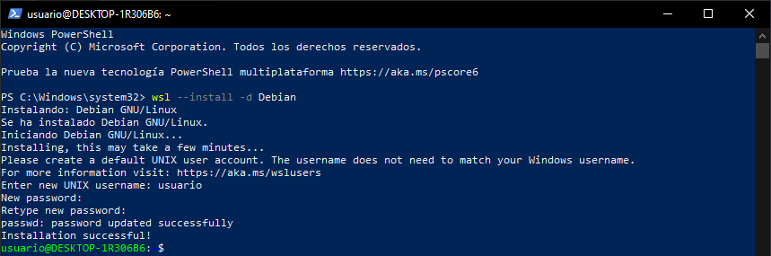
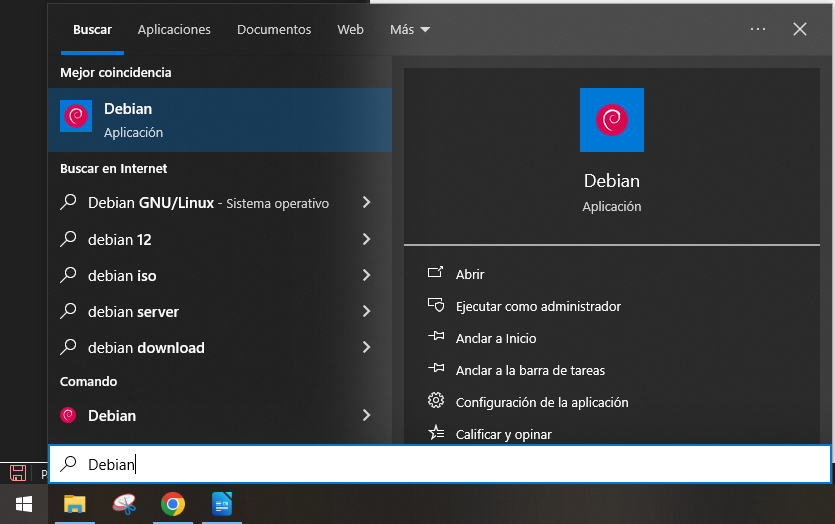
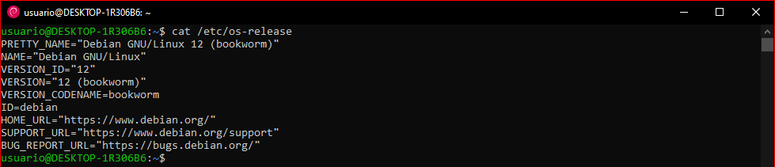
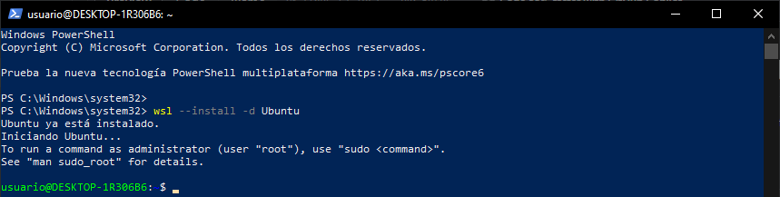
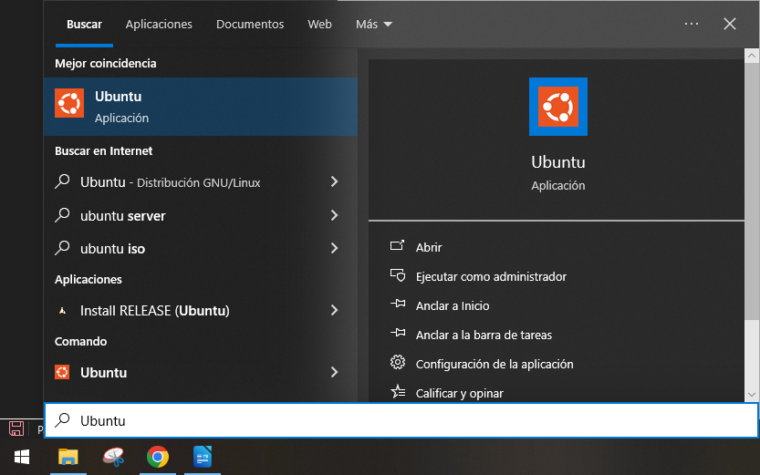
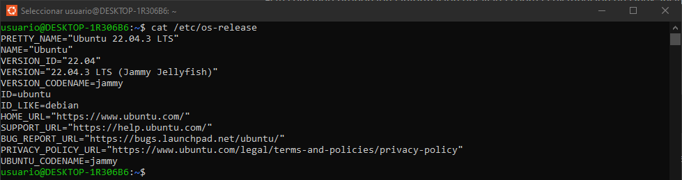

# INSTALACIÓN DE DISTRIBUCION DEBIAN Y UBUNTU
En este apartado veremos como de versátil es Windows Subsystem For Linux a la hora de instalar diferentes distribuciones.

## DEBIAN

## PASO 1:

> La instalación de esta distribución es tan sencilla como abrir una PowerShell como administrador y ejecutar el comando `wsl --instal -d Debian`.

> Una vez instalada cerraremos la línea de comandos y solo nos bastará irnos a *Inicio* y escribir *Debian*.

> Para comprobar que estamos en Debian le echaremos un vistazo al fichero *os-release* con el comando `cat /etc/os-release`.

---

## UBUNTU

## PASO 1:

> Al instalar Windows Subsystem For Linux de forma predeterminada se nos instala la distribución de *Ubuntu*, pero si quisieramos instalarla directamente porque no estuviera como por defecto solo tendriamos que abrir abrir una PowerShell como administrador y ejecutar el comando `wsl --instal -d Ubuntu`.

> Una vez instalada cerraremos la línea de comandos y solo nos bastará irnos a *Inicio* y escribir *Ubuntu*.

> Para comprobar que estamos en Ubuntu le echaremos un vistazo al fichero *os-release* con el comando `cat /etc/os-release`.
