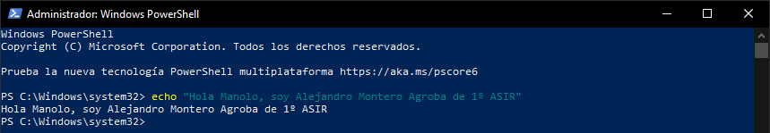
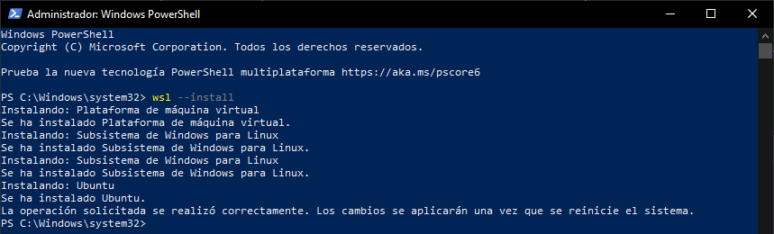
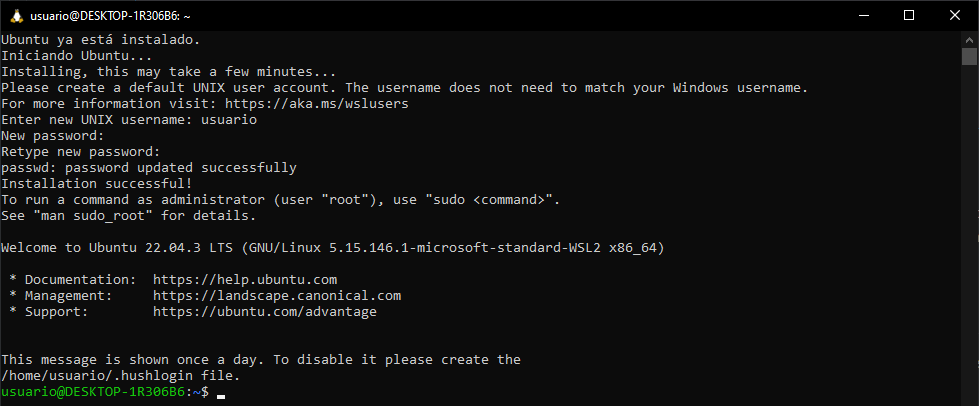
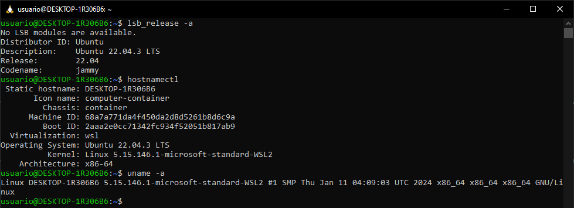

# INSTALACIÓN DE WSL MEDIANTE POWERSHELL
Para la instalación lo único que tendremos que hacer será abrir una línea de comandos PowerShell como administrador y seguir los siguientes pasos:

## PASO 1:

> Aquí hice un `echo` para demostrar que soy yo y es mi máquina.

## PASO 2:

> Lo primero que tendremos que hacer será ejecutar el comando `wsl --install` y esperar unos minutos a que se instalen todas las cosas necesariás para utilizar Windows Subsystem For Linux. Una vez completado deberemos de 
reiniciar nuestra máquina.

## PASO 3:

> Al reiniciar nuestra máquina automáticamente se nos abrirá esta ventana que es donde se arrancará la distribución Linux predeterminada de WSL que es **Ubuntu**. Tendremos que crearnos un usuario y una contraseña para el
mismo.

## PASO 4:

> Para hacer unas pequeñas comprobaciones ejecutaremos comandos como `lsb_release -a`, `hostnamectl` y `uname -a` para saber más información sobre la distribución instalada.
