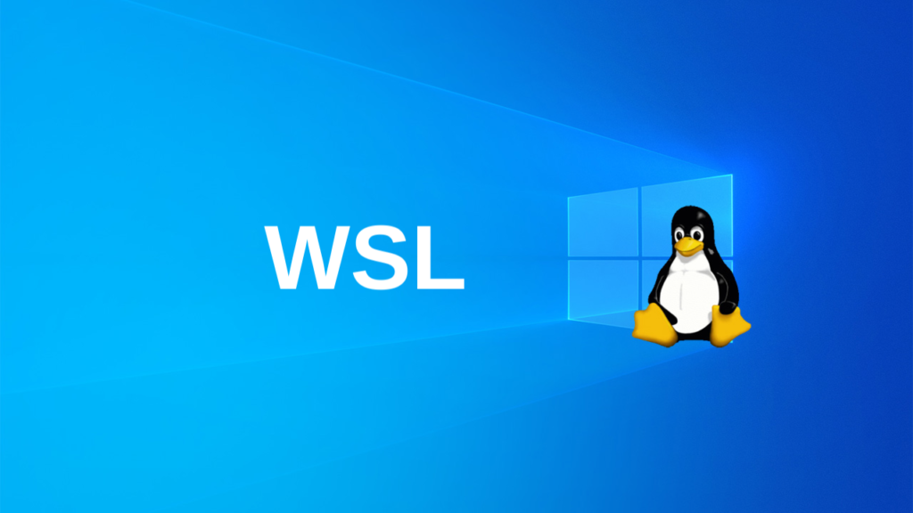

# ¿QUÉ ES WSL?

> Breve descripción de que es, cuales son sus caracteristicas y cuales sus usos.

## 1. ¿QUÉ ES?
Windows Subsystem for Linux (WSL) es una característica de Windows 10 y Windows 11 que permite a los usuarios ejecutar un entorno de Linux directamente sobre Windows, sin la necesidad de una máquina virtual 
o un arranque dual. WSL proporciona una capa de compatibilidad para que los binarios ejecutables de Linux (en formato ELF) puedan ejecutarse nativamente en un sistema Windows.

---

## 2. CARACTERÍSTICAS PRINCIPALES
  1. **Ejecución de Linux en Windows**: Permite ejecutar distribuciones de Linux completas, como Ubuntu, Debian, Fedora, y otras, dentro de Windows.

  2. **Compatibilidad de comandos y herramientas**: Los usuarios pueden ejecutar herramientas de línea de comandos de Linux, scripts de Bash, y otros programas de Linux directamente en Windows.

  3. **Integración de archivos**: Permite el acceso a los archivos del sistema de Windows desde Linux y viceversa, facilitando el intercambio de archivos entre ambos sistemas.

  4. **Reducción de recursos**: A diferencia de las máquinas virtuales, WSL consume menos recursos del sistema (memoria y CPU), ya que no requiere un kernel de Linux completo ni virtualización de hardware.

  5. **WSL 1 vs WSL 2**:
     - **WSL 1**: La versión original que traduce las llamadas del sistema Linux a llamadas del sistema Windows. Tiene un rendimiento adecuado para muchas tareas, pero carece de compatibilidad completa
       con todas las funciones de Linux.
     - **WSL 2**: Introducida en 2019, esta versión incluye un kernel de Linux real corriendo en una máquina virtual liviana, mejorando la compatibilidad y el rendimiento. Proporciona una experiencia
       más cercana a la ejecución en hardware real de Linux.
       
---

## 3. USOS COMUNES
  - **Desarrollo de software**: Los desarrolladores pueden utilizar sus herramientas y entornos de desarrollo preferidos de Linux directamente en Windows.
  - **Aprendizaje y experimentación**: Es una excelente herramienta para aprender y experimentar con Linux sin necesidad de cambiar de sistema operativo.
  - **Automatización y scripting**: Permite el uso de scripts de Bash y herramientas de automatización de Linux en entornos de Windows.
  - **DevOps y administración de sistemas**: Facilita la ejecución de herramientas de administración y despliegue que son nativas de Linux.
