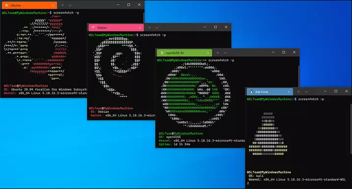

# PROCESOS ASOCIADOS A WSL

> Cuando se utiliza Windows Subsystem For Linux para evitar la sobrecarga de una máquina virtual tradicional, este tiene asociados varios procesos para su funcionamiento que son los siguientes:

* 1. **wsl.exe**: Este es el ejecutable principal que inicia y gestiona las instancias de WSL. Es el proceso que el usuario invoca para iniciar una sesión de WSL desde la línea de comandos de Windows.

* 2. **bash.exe**: En versiones anteriores de WSL (WSL 1), este proceso se utilizaba para iniciar una sesión de bash en Linux. En versiones más recientes, este comando redirige a wsl.exe.

* 3. **vmmem**: Este proceso es responsable de gestionar la memoria asignada a WSL. Aparece en el Administrador de tareas de Windows y consume memoria en proporción a la actividad y la carga de trabajo de WSL.

* 4. **vmwp.exe (Virtual Machine Worker Process)**: Este proceso está asociado con las máquinas virtuales en Hyper-V y puede estar relacionado con WSL 2, que utiliza una máquina virtual ligera basada en Hyper-V
  5. para ejecutar el kernel de Linux.

* 5. **init**: En WSL, el proceso init es el primer proceso que se ejecuta en el entorno Linux. En WSL 2, es un proceso del sistema que maneja la inicialización y la supervisión de otros procesos dentro del entorno Linux.

* 6. **lxssmanager.dll**: Este componente del sistema operativo Windows gestiona la instancia de WSL y los servicios asociados. No es un proceso visible en el Administrador de tareas, pero es crucial para el
  7. funcionamiento de WSL.

* 7. **LxssManagerUser**: Este es un servicio de Windows que se encarga de gestionar el entorno de usuario para WSL.

* 8. **Kernel de Linux (en WSL 2)**: En WSL 2, hay un kernel de Linux real corriendo dentro de una máquina virtual ligera de Hyper-V. Este kernel maneja las llamadas al sistema y otras tareas del sistema operativo Linux.
